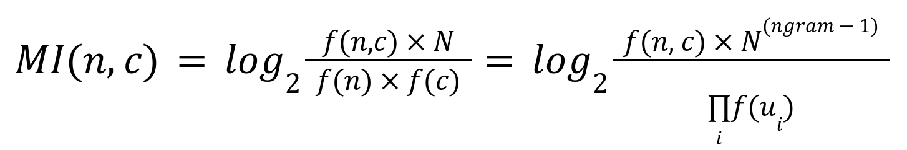
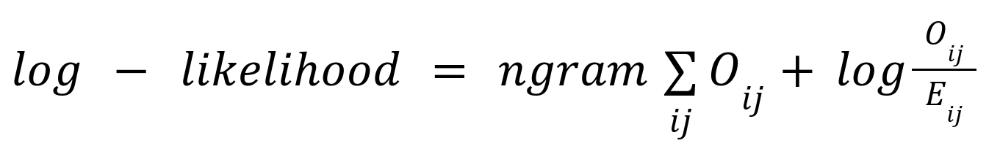
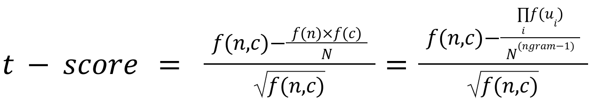
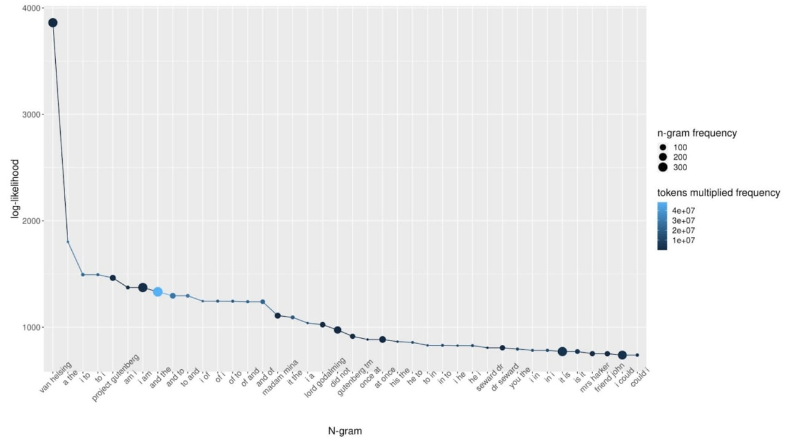

# Лабораторная работа №3 (N-grams)

## Синопсис лекции

**Меры ассоциативной связанности (`association measures`)**  - меры, вычисляющие силу связи между элементами в составе коллокации (параметры: частота совместной встречаемости, частота слова в корпусе, размер корпуса, и др.).  

Подробное описание мер ассоциативной связанности можно изучить в работе [М.В. Хохловой “Экспериментальная проверка методов выделения коллокаций”](https://blogs.helsinki.fi/slavica-helsingiensia/files/2019/11/sh34-21.pdf). В частности, **мера MI (Mutual Information)** чувствительна к низкочастотным словам, а **мера t-score** полезна для поиска высочастотных коллокаций.  



`n` — ключевое слово (`node`);  
`c` — коллокат (`collocate`);  
`f (n, c)` — частота встречаемости ключевого слова `n` в паре с коллокатом `c`;  
`f(n)`, `f(c)` — абсолютные (независимые) частоты ключевого слова `n` и слов `c` в корпусе (тексте) соответственно;  
`N` — общее число словоупотреблений в корпусе (тексте);  
`ngram` - количество слов в `n`-грамме (например, для триграмм `ngram = 3`);  
`f(u_i)` - абсолютная частота `i`-й униграммы в `n`-грамме.  


`O_ij`, `E_ij` - наблюдаемая и ожидаемая частоты соответственно;  
`ngram` - количество слов в `n`-грамме (например, для триграмм `ngram = 3`).  
Рекомендуется прочитать стр. 346 в работе [М.В. Хохловой “Экспериментальная проверка методов выделения коллокаций”](https://blogs.helsinki.fi/slavica-helsingiensia/files/2019/11/sh34-21.pdf), содержащей более подробное описание данной меры ассоциативной связанности.  


`n` — ключевое слово (`node`);  
`c` — коллокат (`collocate`);  
`f (n, c)` — частота встречаемости ключевого слова `n` в паре с коллокатом `c`;  
`f(n)`, `f(c)` — абсолютные (независимые) частоты ключевого слова `n` и слов `c` в корпусе (тексте) соответственно;  
`N` — общее число словоупотреблений в корпусе (тексте);  
`ngram` - количество слов в `n`-грамме (например, для триграмм `ngram = 3`);  
`f(u_i)` - абсолютная частота `i`-й униграммы в `n`-грамме.  



## Задание

Необходимо извлечь триграммы и выполнить подсчет соответствующих мер ассоциации для выбранного корпуса.

1. На основе первого практического задания сформировать данные (список) для расчета n-грамм по словоформам / лексемам (лексема - то же, что лемма) в зависимости от доставшегося варианта;  
2. Очистить полученные данные от знаков пунктуации. Можно использовать регулярное выражение: `[^\P{P}-]+`;  
3. Привести полученные данные к нижнему регистру;  
4. Очистить полученные данные от стоп слов. Можно использовать `nltk.corpus.stopwords`;  
5. Извлечь триграммы из текста выбранного корпуса и посчитать их частоты;  
6. Реализовать алгоритм расчета меры ассоциации (в зависимости от доставшегося варианта);  
    * словоформы, `MI` (вариант 1);  
    * словоформы, `t-score` (вариант 2);  
    * словоформы, `log-likelihood *` (вариант 5);  
    * лексемы, `MI` (вариант 3);  
    * лексемы, `t-score` (вариант 4);  
    * лексемы, `log-likelihood *` (вариант 6).  

   `*` - варианты повышенной сложности, предполагающие получение дополнительных баллов.

7. Проверить результаты с помощью библиотеки `nltk`, пример скрипта (без удаления стоп слов и пунктуации):  

```py
import nltk
from nltk.collocations import *
from nltk.corpus import PlaintextCorpusReader

bigram_measures = nltk.collocations.BigramAssocMeasures()
trigram_measures = nltk.collocations.TrigramAssocMeasures()

f = open('text.txt')
raw = f.read()

tokens = nltk.word_tokenize(raw,'russian',True)
#print(tokens[:10])

text = nltk.Text(tokens)

#http://www.nltk.org/_modules/nltk/collocations.html
finder_bi = BigramCollocationFinder.from_words(text)
finder_thr = TrigramCollocationFinder.from_words(text)

print(finder_bi.nbest(bigram_measures.pmi, 10))
print(finder_thr.nbest(trigram_measures.pmi, 10))
```

На защите лабораторной продемонстрировать работу алгоритмов (собственный, `nltk`), показать список из `top-30` триграмм, объяснить различия в результатах.
