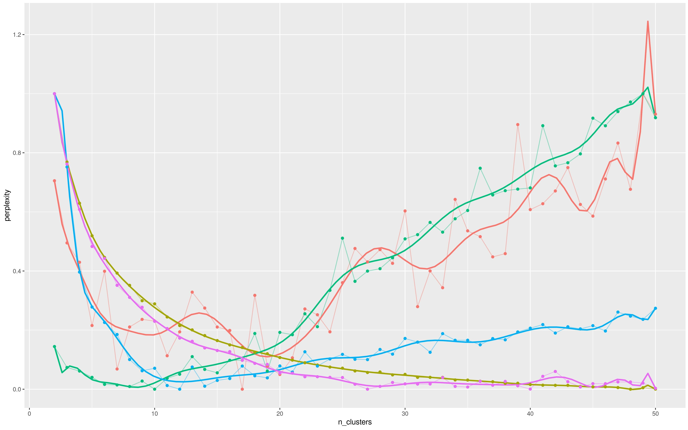

# Лабораторная работа №6 (Тематическое моделирование)

## Синопсис лекции

**Тематическое моделирование** - метод автоматической обработки коллекции текстовых документов путем их кластеризации по темам (topics), затрагиваемым в каждом документе.  
**LDA** - метод построения статистической модели текстовых документов путем внесения скрытого (unobserved) множества абстрактных объектов - тем (topics), порождающих документы коллекции.  
**CTM** - метод построения статистической модели текстовых документов, являющийся расширением `LDA` и основанный на введении дополнительного набора латентных переменных, которые соответствуют укрупненным документам (aggregated documents).  
**Gibbs sampling** - метод формирования выборки элементов из заданного набора с использованием условных вероятностей для аппроксимации сложных распределений нескольких случайных переменных.  
**Perplexity** - метрика, отражающая соответствие вероятностной модели некоторму набору текстовых данных.  
**r-squared** - метрика, отражающая соответствие модели некоторому набору числовых данных.  

## Задание

1. С использованием полученной в результате выполнения [четвертой лабораторной работы](/tasks/task-04) матрицы "термин-документ" (term-document matrix) осуществить эксперименты с любой существующей моделью тематического моделирования документов (например, `LDA` или `CTM`). Допускается использовать библиотечные реализации. В каждом эксперименте необходимо задавать различное количество кластеров (для модели `LDA` рекомендуемое количество - от 2 до 50, необходимо проверить по крайней мере 5 значений в данном диапазоне при выборе модели `LDA`: 2, 5, 10, 20, 40; для модели `CTM` вследствие более высокой вычислительной сложности рекомендуется реализовать эксперименты с 3 значениями в качестве количества тем: 2, 5, 10). Помимо всего прочего, в одном из экспериментов количество кластеров должно быть задано равным количеству классов документов в выбранном датасете. Для каждого эксперимента зафиксировать:
    * топ-10 ключевых слов для каждой темы;
    * `perplexity` полученной модели на тестовой выборке (потребуется использовать реализацию алгоритма для построения матрицы "термин-документ", разработанную при выполнении предыдущей лабораторной работы). Допускается использование библиотечной реализации алгоритма подсчета `perplexity` (например, для языка программирования `python` существует [стандартная реализация в пакете `scikitlearn` для модели `LDA`](https://scikit-learn.org/stable/modules/generated/sklearn.decomposition.LatentDirichletAllocation.html#sklearn.decomposition.LatentDirichletAllocation.perplexity));
    * вероятность принадлежности документов обучающей выборки к той или иной теме, а также документы для каждой темы, у которых данная вероятность наиболее высока. Данный пункт предполагает формирование и сохранение в произвольном формате (рекомендуется использовать тот же формат, что и в [четвертой лабораторной работе](/tasks/task-04) при сохранении результатов векторизации документов из тестовой выборки) для каждого документа обучающей выборки `N` вещественных чисел, характеризующих вероятность принадлежности документа к каждой из `N` тем.
1. После выполнения экспериментов построить график изменения `perplexity` в зависимости от количества тем, построить полиномиальную аппроксимацию полученного графика, количество элементов полинома выбрать с использованием метрики `r-squared`.
1. На основе собранных экспериментальных данных сформулировать вывод о том, какое количество тем является оптимальным в соответствии с имеющимися текстовыми данными. Для получения дополнительных баллов по данному пункту требуется повторить предыдущие шаги для нескольких значений количества итераций (по крайней мере еще двух - требуется проверить количество итераций в 2 раза больше и в 2 раза меньше исходного значения соответственно), реализуемых в процессе обучения, сформулировать вывод о том, какое количество итераций является оптимальным.
