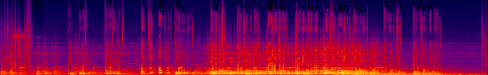

# Лабораторная работа №7 (Распознавание и синтез речи)

## Синопсис лекции

**Automatic Speech Recognition (ASR)** или распознавание речи — процесс преобразования речи в текст.  
**Text-To-Speech (TTS)** или синтез речи — процесс генерации речи по тексту.

## Задание:
Необходимо выполнить распознавание и/или синтез речи для предложенной вами задачи. Задачу можно предложить любую, ниже представлен список базовых примеров: 

* Распознавание речи для управления вашим сервисом. Выполнить распознавание речи и вызвать соответствующую команду для вашего сервиса через API.
* Распознавание речи для умного дома. Выполнить распознавание речи и вызвать соответствующую команду для умного дома через API. 
* Распознавание речи для выполнения отекстовки видео/аудио уроков.
* Распознавание речи для выполнения отекстовки встреч по проекту. Например, командные митинги.
* Синтез речи для чат бота/голосового помощника. Например, синтез речи для озвучки команд навигатора.
* Синтез речи для озвучки лекций и/или учебных документов.
* Синтез речи для озвучки уведомлений.

Можно использовать самостоятельно найденные сервисы/модели, но необходимо продемонстрировать, как именно вы их использовали. Примеры сервисов и/или моделей, которые можно использовать:
* **Speech-to-text**: https://huggingface.co/jonatasgrosman/wav2vec2-large-xlsr-53-russian  
* **Text-to-speech**: https://huggingface.co/facebook/tts_transformer-ru-cv7_css10   
